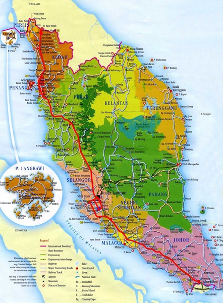

<h2 align="center">DATA GEOSPASIAL</h2> 

<strong> Pengertian Geospasial</strong>
Geospasial adalah keruangan yang menunjukkan lokasi, wilayah, letak dan posisi suatu objek yang berada dibawah atau diatas permukaan bumi yang dinyatakan pada system titik koordinat tertentu.  
Penyajian data spasial punya tiga cara yaitu :  
Titik ialah gambar tunggal dari sepasang koordinat a,b yang menunjukan lokasi berupa ketinggian, lokasi kota, dan lain sebagainya.  
Garis ialah sekumpulan titik yang membentuk suatu yang tampak memanjang seperti sugai, jalan, kontus dan lainnya.  
Polygon ialah kumpulan garis  
 
Data geospasial terbagi menjadi 2, yaitu Vektor dan Raster  
 

 

 
Vektor adalah data titik koordinat (kumpulan titik) yang bisa menjadi garis  
format dari vektor adalah .shp (shape file/keluarkan)  
diluncurkan : ESRI 
data vektor terbagi 2 diantaranya :  
<i>1.vektor cultural</i> ialah data vektor yang dipengaruhi oleh peradaban. 
contohnya   
bangunan  
nama kota  
batas wilayah  
batas kota  
batas negara   
batas provinsi  
2. physical ialah sesuatu yang ada dan nyata terlihat dibumi dan tidak bisa hilang.  
sebagai contohnya itu laut, pulau, garis pantai, benua dan yang lainnya.  
 
Raster adalah data gambar.  
format dari raster adalah JPG, 2000, ECW.
contoh dari raster sendiri adalah pewarnaan yang ada di peta  
(warna gradasi menunjukkan ketinggian)

 

 

untuk mempelajari geospasial bisa mendownload Natural Earth 
tiga buah data yang bisa didownload. 
yang membedakannya hanya skalanya. 
 
aplikasi yang dapat digunakan adalah QGIS atau untuk alternatif menggunakan pyshp 
 
kesimpulan 
Geospasial adalah keruangan yang menunjukkan lokasi, wilayah, letak dan posisi suatu objek yang berada dibawah atau diatas permukaan bumi yang dinyatakan pada system titik koordinat tertentu dan memiliki dua buat model yaitu vector dan raster. 

