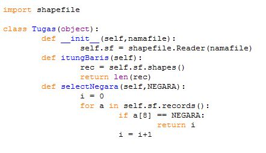
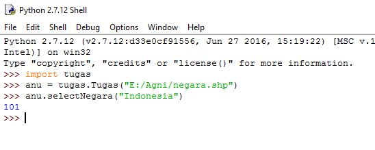

<h2 align="center">PEMBUATAN METHOD DAN CLASS RETRIVE DATA GEOSPASIAL</h2> 

 
Latar belakang masalah : 
Pengetahuan mengenai cara memanipulasi data retrieve(melihat data/menghitung jumlah data) masih sangat sedikit, saya akan menjeaskan sedikit bagaimana caranya dengan penggunaan data shapefile geospasial dengan menggunakan bahasa pemrograman phyton dan juga cara penggunaan class dan method. 
1.	Apa itu Retrive Data ? 
2.	Apa itu Shapefile ? 
3.	Apa itu Geometri ?<b>
4.	Bagaimana Operasi Pengambilan Data ? 
5.	Buatlah Class Geospasial Editor ? 
6.	Bauatlah Method Select, Where Negara ? 
 
Isi : 
Retrive Data Geospasial adalah Meretrive Data Vektor. 
Data Shapefile.shp 
Operasi Retrive Data menggunakan Library python yang bernama py.shp  
Shapefile adalah Syandard file 
Vektor Geospasial dikeluarkan oleh ESRI 
  
 

 

 
Geometri 
Data koordinat yang membentuk bangun datar atau ruang diantaranya : 
1.	Point/titik [1] 
2.	Line/garis [3] shapefile,type 
3.	Polygon [5] 
 
Operasi Pengambilan Data 
Menggunakan library pyshp, class shapefile 
1.	Buka/baca 
2.  

 
 
 
DBF adalah sebuah file yang menyimpan file tabular yang menyimpan data attribut. 
Method dari DBF 
Fields : nama field 
record(n) 
Record (n) baris ke (n) records 
# (n) adalah nomor sequence record 
 
Method dari SHP 
shapes() - Menampilkan semua 
shape(n) - Menampilkan dengan parameter 
 
1.	Bbox adalah sebuah boundary box (koordinat 4 titik) atau koordinat batas view yang ada pada peta. 
Contohnya : 
 

 
  
 Koordinat a,b,c,d itu di sebut bbox 
 
2.	Parts itu apakah record ini bagian dari record lain/ precahan relasi 
3.	points adalah koordinat pembentukan peta 
4.	shapetype adalah jenis geometri dari points 
 
polygon digunakan untuk batas tertutup/kembali ke titik awal 
contoh : bentuk suatu benua atau wilayah 
 
polyline tidak kembali ketitik awal  
contoh : jalan, sungai, batas wilayah, dll. 
 
 
Membuat Class pada Retrive di editor
 

 
  
 Menampilkan Select Negara
 

 
  
Penutup 
Kesimpulan 
Dapat kita ketahui bagaimana membuat class dan penggunaan method method yang terdapat pada retrieve data
 
 
Saran 
sulitnya memahami penggunaan method, kurang nya latihan praktek di kelas, diperbanyak praktek di dalam kelas nya
